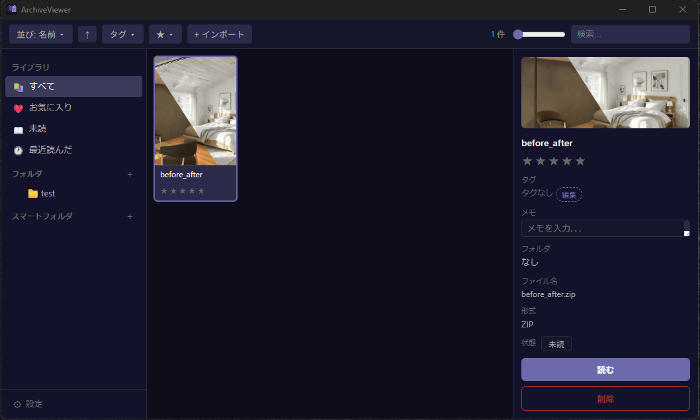
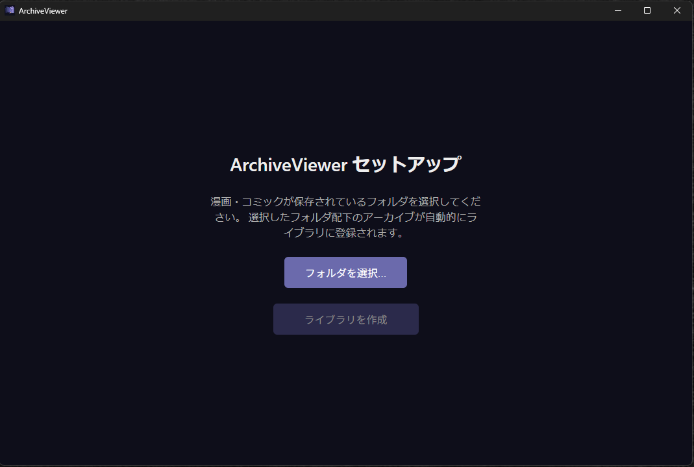
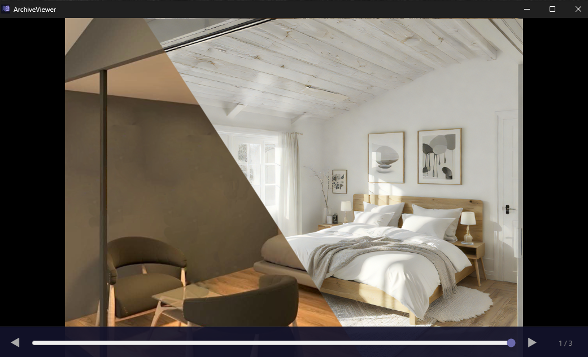

# ArchiveViewer

[日本語](README.md)

A desktop manga/comic archive viewer for Windows, built with Tauri 2 + React 19 + Rust.

<br>

<p align="center">
  
</p>

<p align="center">
  
  
</p>

<br>

## Features

- **Archive support** — ZIP (`.cbz`, `.zip`) and RAR (`.cbr`, `.rar`) files
- **Library management** — Organize comics with hierarchical folders, tags, and smart folders (dynamic filter-based collections)
- **High-quality rendering** — WebGL2 area-averaging shader for crisp downscaling (equivalent to WPF's `BitmapScalingMode.Fant`)
- **Spread view** — Automatic detection of landscape (spread) pages; side-by-side display with correct page order
- **Reading progress** — Per-archive read position saved automatically
- **Backup & restore** — Export your entire library (archives + database) to a ZIP, and import it on any machine
- **Missing file detection** — Startup integrity check flags moved/deleted files without removing metadata

## Tech Stack

| Layer | Technology |
|---|---|
| UI | React 19, TypeScript, Zustand, react-virtuoso |
| Desktop | Tauri 2 (Rust backend, WebView frontend) |
| Database | SQLite via rusqlite (WAL mode) |
| Rendering | WebGL2 fragment shader (area-averaging) |
| Archives | zip 2, unrar 0.5 |

## Requirements

- Windows 10/11 (64-bit)
- WebView2 runtime (bundled with Windows 11; downloadable for Windows 10)

## Building from Source

### Prerequisites

- [Node.js](https://nodejs.org/) 18+
- [Rust](https://rustup.rs/) (stable, 1.77.2+)
- [Visual Studio Build Tools](https://visualstudio.microsoft.com/visual-cpp-build-tools/) (for Rust on Windows)

### Development

```bash
# Install frontend dependencies
npm install

# Run the full desktop app with hot reload
npx tauri dev
```

### Production Build

```bash
# Release build (runs npm ci + tauri build)
.\build.bat

# Or manually
npm ci
npx tauri build
```

The installer and executable will be in `src-tauri/target/release/bundle/`.

## Running Tests

```bash
# Rust unit/integration tests
cd src-tauri && cargo test

# TypeScript type check
npx tsc --noEmit

# Lint
npm run lint
```

## Project Structure

```
src/                    # React frontend
  pages/                # SetupWizard, LibraryPage, ViewerPage
  components/
    common/             # Shared UI primitives
    library/            # Grid, sidebar, detail panel
    viewer/             # Reader, WebGL page renderer, spread layout
  stores/               # Zustand stores (library, viewer, toast)
  hooks/                # useTauriCommand, useKeyboardShortcuts, useDragDrop

src-tauri/src/          # Rust backend
  commands/             # Tauri IPC handlers (library, archive, viewer, drag_drop, settings)
  db/                   # SQLite: migrations, queries, models
  library/              # Import pipeline, startup integrity check
  archive/              # ZIP/RAR extraction (common trait + per-format impl)
  imaging/              # Thumbnail generation
  config.rs             # App config (exe dir/config.json)
```

## Data & Config Locations

| Path | Contents |
|---|---|
| `<exe_dir>\config.json` | App settings (library path, window state) |
| `<library>/archiveviewer.db` | SQLite database |
| `<library>/archives/<id>/` | Original archive files |
| `<library>/archives/<id>/pages/` | Page cache (auto-invalidated on version change) |
| `<library>/thumbnails/` | Cover thumbnails (JPEG) |

## License

MIT
